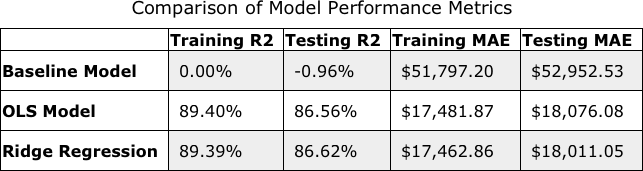

# Housing Price Prediction Project

## Project Goal

My project aims to predict the sale price of houses. By predicting the sale price of houses, a prospective seller could have a good understanding of the value of the home, given its attributes. In addition, a prospective seller could strategicaly focus on home enhancements that would have the greatest ROI at time of sale. 

## Findings
My current preferred model is able to explain about 86% of the variance in the sale prices of homes, and on average predicts a sale price that is 18,001 away from the actual sale price

## Data Source and Data Exploration

This data comes from a [Kaggle competition](https://www.kaggle.com/c/house-prices-advanced-regression-techniques/) which provides details about homes in Ames, Iowa. 

The target variable shows that there are some outliers in the data, which are homes that were sold at much higher prices than most of the other homes in the dataset.

I used 42 columns for my analysis, which included variables about: 

 - the age and quality of the house
 - the total size of both the lot and the house itself
 - the number of bedrooms and bathrooms
 - additional features like porches, garages, basements, etc.
 
The most correlated feature to the target, which was also the most informative feature in my preferred model, is the Overall Quality of the house (`OverallQual`).

## Data Preparation

Because I used only numeric columns, I did not perform any encoding techniques. However, I did convert a few discrete variables such as "number of fireplaces" to "has fireplace"

## Modeling

I began with a baseline that predicts only the mean house price from the training data for each house. My final model is a Ridge regression model, which uses L-2 regularization to manage the multicollinearity between the features used in the model.




## Evaluation

I used both the Coefficient of Determination (R2 Score) and Mean Absolute Error to evaluate my models. I wanted to make sure these two very different metrics were evaluated so I could see how my models are trending overall. The benefit of R2 Score is I can see how well my model explains the variance of the target, the house sale price, while the Mean Absolute Error is able to explain how off my predictions were on average in real dollar terms. I trained my model on two-thirds of the data for which I knew the actual sale price, then tested my results on the remaining third.

My final preferred model, a Ridge regression model, achieved an R2 Score of `.8662` and a Mean Absolute Error of `24,244` on the test set. In real terms, this means the Ridge regression model explains about 86% of the variance of the target variable, the house sale price, and that on average my predictions are about 18,001 away from the actual value. 

## Next Steps

In the future I would like to first use more of the categorical features, and perhaps encode some of the discrete features I used in my final model. I would also like to then only use the most important features, perhaps by regularizing using both LASSO and Ridge through an ElasticNet model. I could also only use the top 5-10 features based on Permutation Importance. 

I'd also like to explore capping my training data so that I create a model that only works on houses priced up to a certain point. This would narrow the target audience of my model, but at the same time Could make it work better on houses that are priced within a specific range. Thus, if I received a result from my model outside that range I could know that my model is likely not accurately pricing that home and thus should be handled using different techniques or models. 

## Repository Guide

```
├── code                                       Code folder, data cleaning and visualization functions
├── data                                       Data folder, which is not included in this repository
├── images                                     Images folder, containing all referenced image files
├── EDA-Modeling-Evaluation.ipynb              Main Jupyter notebook, contains analysis
├── House-Price-Prediction_Presentation.pdf    PDF Version of project presentation
├── README.md                                  The top-level README 
└── __init__.py                                python package file

```

## Reproduction Instructions

This project uses:

- [Anaconda](https://www.anaconda.com/), a package and environment management tool
- Python 3.6.9, with the following additional packages/libraries:

    - [Pandas 0.25.1](https://pandas.pydata.org/)
    - [NumPy 1.16.5](https://numpy.org/)
    - [Matplotlib 3.1.1](https://matplotlib.org/)
    - [Seaborn 0.9.0](https://seaborn.pydata.org/)
    - [Scikit-Learn 0.22.1](https://scikit-learn.org/stable/)
    - [Eli5 0.10.1](https://eli5.readthedocs.io/en/latest/overview.html)

If you would like follow the analysis locally and have the above tools:

1. Fork and clone this repository
2. Go to the Kaggle competition page and download the data files
3. Save the `train.csv` data file into a `data/` folder which is at the same level as the notebook

You should then be able to run the exploration and analysis in the provided [EDA-Modeling-Evaluation Jupyter Notebook](https://github.com/learn-co-curriculum/dsc-postgrad_House-Price-Prediction/blob/master/EDA-Modeling-Evaluation.ipynb).

## Sources:

- [Data Source: Kaggle](https://www.kaggle.com/c/house-prices-advanced-regression-techniques/data)
- [README Header Image Source: Lending Tree](https://www.lendingtree.com/home/mortgage/how-to-buy-a-house-when-your-current-home-hasnt-sold/)

## Contact Information

With questions or feedback on this repository, please reach out via:
- [GitHub](https://github.com/learn-co-curriculum)
- [LinkedIn](https://www.linkedin.com/school/the-flatiron-school/)
